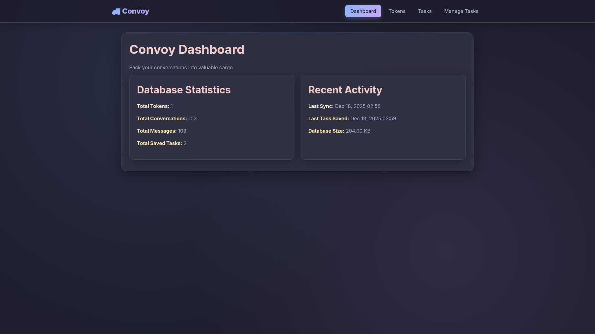
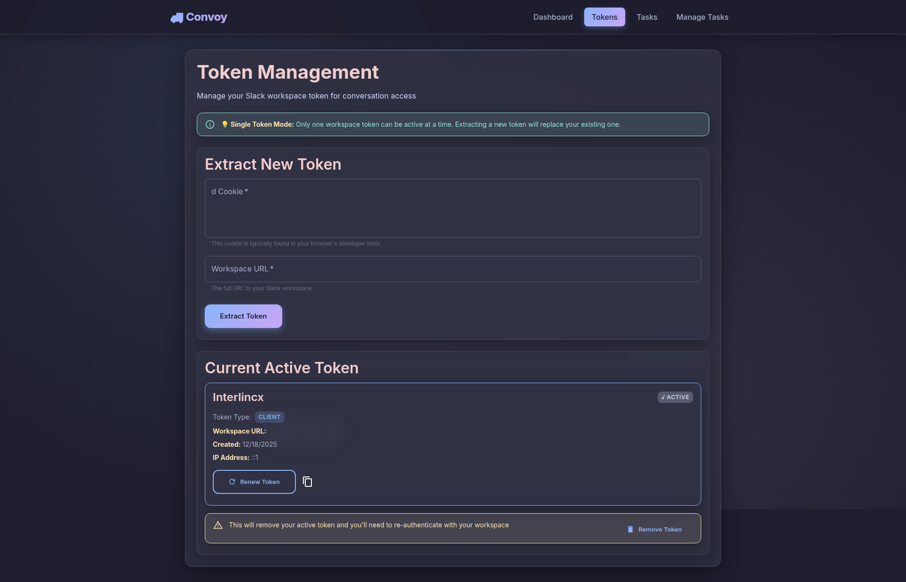
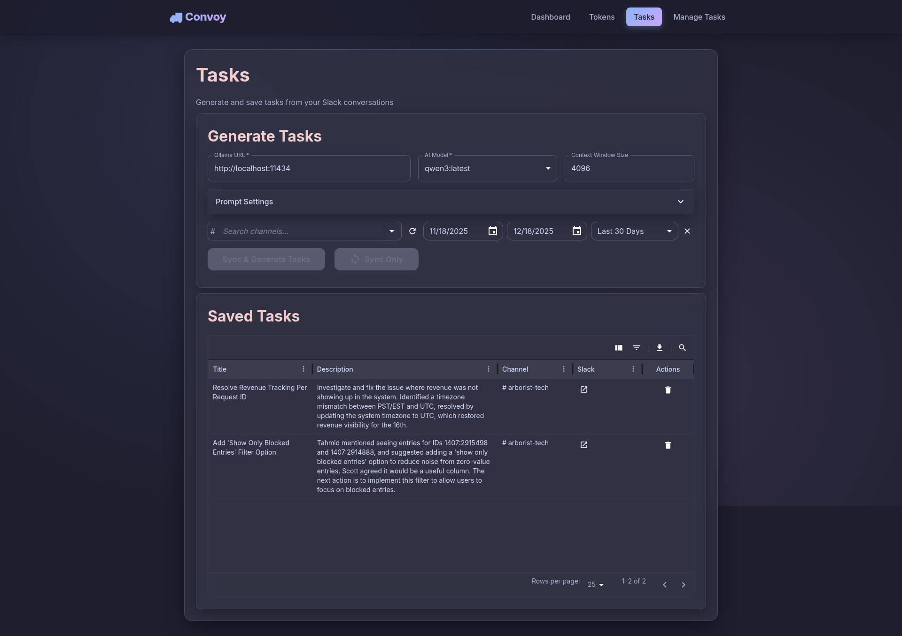
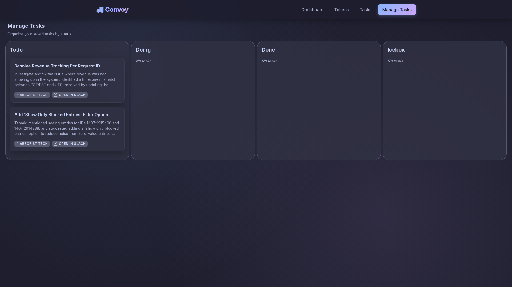

# 🚚 Convoy

**Pack your conversations into valuable cargo** - Transform Slack conversations into actionable tasks with AI-powered intelligence.

[](https://opensource.org/licenses/ISC)
[](https://nodejs.org/)

---

## ✨ Features

- ✅ **Slack Integration** - Seamlessly connect to your Slack workspace and extract conversations
- 🤖 **AI-Powered Task Generation** - Use Ollama models to intelligently generate tasks from conversations
- 📋 **Kanban Task Management** - Organize tasks with drag-and-drop Kanban boards (Todo, Doing, Done, Icebox)
- 🔄 **Conversation Sync** - Sync conversations from multiple Slack channels with date range filtering
- 💾 **Smart Task Saving** - Save individual tasks you want to keep and manage them efficiently
- 📊 **Dashboard Analytics** - Track your tokens, conversations, messages, and saved tasks

---

## 🎯 Why Convoy?

Tired of losing important action items buried in Slack conversations? Convoy helps you:

- **Extract value** from team discussions automatically
- **Never miss** important tasks mentioned in conversations
- **Organize** your work with an intuitive Kanban interface
- **Stay productive** by turning discussions into actionable items

---

## 📸 Screenshots

<table>
<tr>
<td width="25%"><strong>Dashboard</strong><br/>Get an overview of your Convoy workspace with real-time statistics and activity tracking.</td>
<td width="25%"><strong>Token Management</strong><br/>Securely manage your Slack workspace tokens with easy extraction and renewal.</td>
<td width="25%"><strong>Task Generation</strong><br/>Generate intelligent tasks from Slack conversations using AI models with advanced configuration options.</td>
<td width="25%"><strong>Kanban Board</strong><br/>Organize and manage your saved tasks with a beautiful drag-and-drop Kanban interface.</td>
</tr>
<tr>
<td></td>
<td></td>
<td></td>
<td></td>
</tr>
</table>

---

## 🚀 Quick Start

### Prerequisites

- **Node.js** v16 or higher
- **npm** (comes with Node.js)
- **Ollama** (for AI task generation) - [Install Ollama](https://ollama.ai)

### Installation

1. **Clone the repository**
   ```bash
   git clone <repository-url>
   cd convoy
   ```

2. **Install dependencies**
   ```bash
   npm run install:all
   ```

3. **Set up environment variables**
   
   Create a `.env` file in the root directory:
   ```env
   NODE_ENV=development
   PORT=3000
   ```

4. **Start the application**
   ```bash
   npm run dev
   ```

   This will start:
   - Frontend: `http://localhost:5173`
   - Backend API: `http://localhost:3000`

### First Steps

1. **Extract a Slack Token**
   - Navigate to the Tokens page
   - Extract your Slack workspace token using the `d` cookie from your browser

2. **Sync Conversations**
   - Go to the Tasks page
   - Select a channel and date range
   - Sync conversations from your Slack workspace

3. **Generate Tasks**
   - Choose an Ollama model
   - Configure your prompts (or use defaults)
   - Generate tasks from synced conversations

4. **Manage Tasks**
   - Save tasks you want to keep
   - Organize them on the Kanban board
   - Drag and drop between columns (Todo, Doing, Done, Icebox)

---

## 🏗️ Architecture

Convoy is built as a monorepo using npm workspaces:

```
convoy/
├── packages/
│   ├── api/         # Express.js backend server
│   │   ├── models/   # Database models (SQLite)
│   │   ├── services/ # Business logic
│   │   └── external/ # External API integrations
│   └── frontend/    # Vite + React frontend
│       ├── pages/   # Main application pages
│       ├── components/ # Reusable components
│       └── services/  # API client
```

### Tech Stack

**Backend:**
- Express.js - Web framework
- SQLite (better-sqlite3) - Database
- Axios - HTTP client

**Frontend:**
- React 18 - UI framework
- Vite - Build tool
- Material-UI - Component library
- React Query - Data fetching
- React Router - Navigation
- Pragmatic Drag & Drop - Kanban functionality

**AI:**
- Ollama - Local LLM integration

---

## 📖 Usage

### Development

Start both frontend and backend in development mode:

```bash
npm run dev
```

Or run them separately:

```bash
# Backend only
npm run dev:api

# Frontend only
npm run dev:frontend
```

### Production

Build the frontend:

```bash
npm run build
```

Start the production API server:

```bash
npm start
```

### Available Scripts

**Root Level:**
- `npm run dev` - Run both frontend and backend in development
- `npm run dev:api` - Run only the backend in development
- `npm run dev:frontend` - Run only the frontend in development
- `npm run build` - Build the frontend for production
- `npm run start` - Start the production API server
- `npm run test` - Run tests for all packages
- `npm run lint` - Lint all packages
- `npm run lint:fix` - Auto-fix linting issues
- `npm run clean` - Clean all build artifacts

---

## 🔌 API Endpoints

### Statistics
- `GET /api/stats` - Get database statistics

### Tokens
- `GET /api/tokens` - List tokens
- `POST /api/extract-token` - Extract token from cookie
- `POST /api/renew-token` - Renew existing token

### Channels
- `GET /api/channels` - Get Slack channels

### Conversations
- `POST /api/sync-conversations` - Sync conversations
- `GET /api/conversations` - Get synced conversations

### Tasks
- `POST /api/tasks/generate` - Generate task list (not saved)
- `GET /api/tasks` - List saved tasks
- `POST /api/tasks` - Save an individual task
- `DELETE /api/tasks/:id` - Delete a saved task

### Ollama
- `GET /api/ollama/models` - Get available Ollama models

---

## 💾 Database

Convoy uses SQLite for data storage. The database file (`convoy.db`) is created automatically in the `packages/api` directory on first run.

**Models:**
- Tokens - Slack workspace authentication
- Channels - Slack channel information
- Conversations - Synced conversation threads
- Tasks - Generated and saved tasks
- Prompts - AI prompt configurations

---

## 🤝 Contributing

Contributions are welcome! Here's how you can help:

1. Fork the repository
2. Create a feature branch (`git checkout -b feature/amazing-feature`)
3. Make your changes
4. Run tests and linting (`npm run test && npm run lint`)
5. Commit your changes (`git commit -m 'feat: add amazing feature'`)
6. Push to the branch (`git push origin feature/amazing-feature`)
7. Open a Pull Request

### Code Style

- **Backend**: Standard.js (no semicolons, 2-space indent)
- **Frontend**: Standard.js (no semicolons, 2-space indent)
- Run `npm run lint:fix` to auto-fix issues

---

## 📝 License

ISC License - see LICENSE file for details

---

## 🙏 Acknowledgments

Built with ❤️ using React, Express, and Ollama.

---

**Ready to transform your Slack conversations into actionable tasks? Get started with Convoy today!** 🚚
